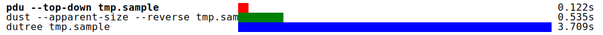

# Benchmark Charts

## tmp.benchmark-report.competing.blksize.svg

## tmp.benchmark-report.competing.extreme-details.svg

## tmp.benchmark-report.competing.len.svg

## tmp.benchmark-report.competing.no-sort+summary.svg

## tmp.benchmark-report.competing.no-sort.svg

## tmp.benchmark-report.competing.progress.svg

## tmp.benchmark-report.competing.summary.svg

## tmp.benchmark-report.competing.top-down.svg

